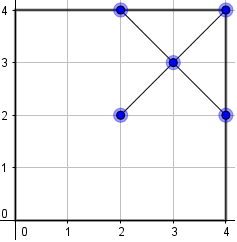
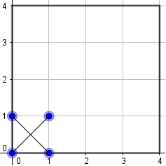

# j174 Crosses - 2017 HKOI Final Event Junior Group
## Problem Statement
Consider a rectangular Cartesian grid with N-by-M coordinates (0,0) to (N,M). We are given K points (x<sub>i</sub>,y<sub>i</sub>) on this grid and need to compute how many *crosses* would contain with all K points.<br>
A *cross* refers to the 2 diagonals of any given square on the cartesian grid.<br>
<tab> 

## Input
The first line of input consists of three integers N, M and K.<br>
The next K lines of input each consists of two integers x<sub>i</sub>, y<sub>i</sub>, meaning that the i<sup>th</sup> point has coordinates (x<sub>i</sub>,y<sub>i</sub>). It is guaranteed that the K points are pairwise distinct.
 
## Output
Output one single integer, the number of different crosses which contains all K given points.

## Sample Tests
**Input 1**
```
2 2 1
0 2
```
**Output 1**
```
2
```
**Input 2**
```
2 3 2
0 0
0 2
```
**Output 2**
```
1
```

## Subtasks
For all cases:<br>
1 ≤ N, M ≤ 10<sup>6</sup>, 0 ≤ K ≤ 200,000, 0 ≤ x<sub>i</sub> ≤ N, 0 ≤ y<sub>i</sub> ≤ M<br>

\# | Points | Constraints
--- | --- | ---
1 | 18 | 1 ≤ N, M ≤ 10
2 | 12 | 1 ≤ N, M ≤ 120
3 | 13 | 1 ≤ N, M ≤ 400
4 | 15 | 1 ≤ N, M ≤ 3000
5 | 9 | K = 0
6 | 11 | K = 1
7 | 22 | no additional constraint
